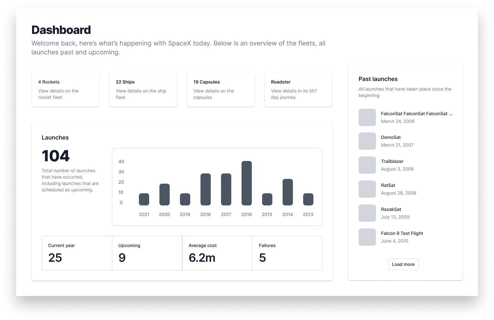

# Sean's progress notes
Start by reading the instructions twice.
Examine the Desktop.png and the demo.mp4
Note - mobile design has been accounted for, approach with mobile first dev/design
Note - It's been too long since I've used GraphQL, utilize RESTful api to fulfil MVP and circle back if there is still time. Styled-components looks easy enough to pick up on the fly, but timebox an attempt to 5 minutes, otherwise move on with colocatted sass files. Recharts is uncharted territory. Utilize a placeholder for now, but circleback to read docs if time permits.
Callouts - attention to detail, responsive design (mobile first), utilize semantic markup appropriately, build from scratch
Plan of attack:
Run getting started section
Access data first - Holdup... Apollo provider looks just like a context provider? Let's timebox that to 10 minutes to see if I can access the data that way. https://www.apollographql.com/docs/react/get-started/
Couldn't do it, commented out attempt - moving on
Build an App component
https://www.figma.com/file/vaaecwSjHZNIXQmYEVVROs/take-home?node-id=0%3A1
breakpoints at 320, 768, 1024, 1440
fetching data has proved to be more time consuming than I had hoped, the REST link breaks often when clicking into the data. Let's focus on building the front end out instead and utilize some lipsum or hard copy as needed

# Maestro Frontend Take-Home Test

Your task is to use the given design (`take-home.fig`, which is a [Figma](https://www.figma.com/) file) and build it using React (other frameworks are fine but this project uses React for a quick start).

### Getting started

- Install the dependencies with `yarn install` or `npm install`.
- Use `yarn start` or `npm run start` if you're using React.
- Open [http://localhost:3000](http://localhost:3000) to view it in the browser.
- The page will reload if you make edits. 
- You will also see any lint errors in the console.

### Preconfiguration

We would rather see how you write code so have set the project up to get started straight away using [Create React App](https://github.com/facebook/create-react-app). The below packages are what `Maestro` is built upon and are preconfigured, but if you decide to use something other than these, than you will need to install them yourself.

- [Apollo GraphQL](https://www.apollographql.com)
- [styled-components](https://styled-components.com) || `sass` || `css`
- [Recharts](https://recharts.org)

The `API` to fetch data is an [unofficial SpaceX GraphQL endpoint](https://api.spacex.land) - if you wish to use `REST` then the endpoint can be found [here](https://api.spacex.land/rest/) (although not confirmed as `GraphQL` was used). _Note: the data isn't up to date but does the job for this project_.

The font `Inter` is already preconfigured and is added to the project within `src/index.js` via `<GlobalFont />`.

Not familiar with `styled-components` - then you can start adding your `sass` or `css` code directly into `src/styles/globalStyle.js`, otherwise creating your own style files works just as well.

### What we're looking for

- **Attention to detail.** Match your code to the design as best as you can. Most values are consistent but it is a possibility there was a slight mistake somewhere! To view the details of each element in the Figma design - you can see the values in the right panel once the element is selected.
- **Make sure it's responsive.** The designs given show what the design should look like at appropriate breakpoints so make sure to match these as best you can.
- **Appropriate markup.** Make sure you use semantic markup as best as you can.
- **Build your components from scratch.** Not including the chart (use `Rechart` or something your comfortable with) but everything else should be built by you and not via a third party library.

### What we're not looking for

- **Old browsers.** Use any modern features you like (eg. `CSS Grid` || `Flexbox`) - `Maestro` doesn't support IE 11 anyway.
- **Tests.** If they assist you in building the project than by all means write them but we're looking for implementing the design and functionality so don't prioritize them.

### Demo

Included is a demo video of what the overall project can look like once completed to give you a better sense of it in real time. We recommend watching this before you get started as some things can't be shown in a design file.

_Note: the demo uses skeleton screens for loading and infinite scroll in the right panel list - these aren't required but are nice to have if you have time (you won't be marked down for not doing these)._

### Submitting

Along with your code, create a short `README.md` file that talks about any interesting things you ran into and/or decisions you made etc. Also use this as a place to tell us any context around a certain decision you've made or if you couldn't get something completed, explain what you would do if you had more time.

Once done, create a public or private repo on Github. If it's private then you can invite me (`rbenstead`).

### Things to note

- The chart in the design won't match `BarChart` in `Recharts` - this is fine. The design is for context that it should be charting data.
